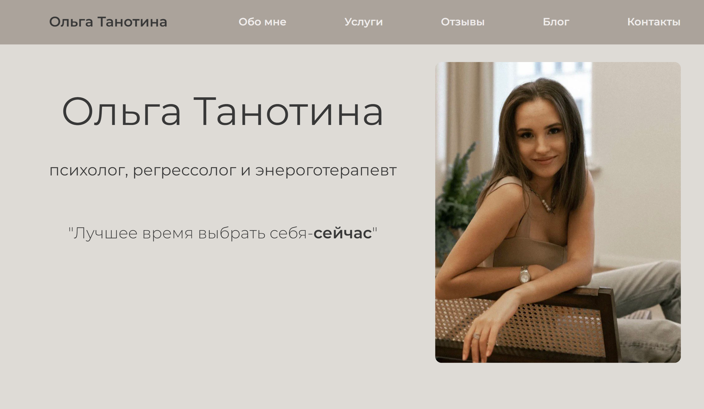

  

    <h1><a href="https://lovebosikova.github.io/superproject/"><strong>Olga-psychologist</strong></a></h1>
        <a href="https://natallia-yarashevich.github.io/Olga-psychologist/"> Посетить сайт </a>
          
          <a href="https://github.com/Natallia-Yarashevich/Olga-psychologist">Сообщить об ошибке</a>  
           
          <a href="https://github.com/Natallia-Yarashevich/Olga-psychologist">Внести предложения</a>
  

  
Содержание

  <ol>
    <li><a href="#о-поекте">О проекте</a></li>
    <li> <a href="#использованные-технологии">Использованные технологии</a></li>
    <li><a href="#функционал-сайта">Функционал сайта</a></li>
    <li><a href="#достижения-которыми-мы-гордимся">Достижения, которыми мы гордимся</a></li>
    <li><a href="#трудности-с-которыми-мы-столкнулись">Трудности, с которыми мы столкнулись</a></li>
    <li><a href="#наша-команда">Наша команда</a></li>
  </ol>

---
## О проекте

Этот веб-сайт разработан для психолога, регрессолога и энерготерапевта Ольги Танотиной.

Веб-сайт был создан командой учениц ITGIRLSHOOL в рамках первого учебного проекта с заказчиком.

#### C помощью нашего веб-сайта пользователь сможет:
* Ознакомиться с услугами 
* Записаться на сеанс
* Прочитать отзывы
* Подписаться на канал 

---
## Использованные технологии

 
 
 
 
 
 

---

## Функционал сайта
* Якорное меню
* Гамбургер-меню на мобильных устройствах 
* Checkbox
* Слайдер
* Многостраничность
* Адаптивность к разным устройствам

---
## Достижения, которыми мы гордимся
Мы получили невероятный опыт работы с заказчиком, командой  и дизайнером. Мы полностью учли все пожелания заказчика и реализовали задумки дизайнера и очень гордимся тем, что создали минималистичный, гармоничный, функциональный и адаптивный веб-сайт.

---
## Трудности, с которыми мы столкнулись
* Адаптивность фотографий ко всем устройствам
* Многостраничность
* Слайдер
---
## Наша команда

   <h3> 
  </h3>

  <h3> 
  </h3>

  <h3> 
  
</h3>

  <h3>
  
  </h3>

  <h3>
  
  </h3>

 <h3>
  
</h3>

 <h3>
   
</h3> 

 <h3>
   
</h3> 
